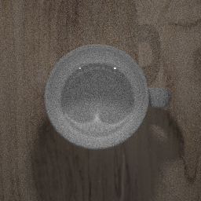

# Very Epic Renderer


A pathtracer and photon-mapper implemented from scratch!
Live demo [here](https://1sanch0.github.io/ver/)!

## Usage

### CLI

List available options:
  
```bash
./ver -h
```

The assets for the scenes are too heavy to be included in the repository, but you can download them from [here](https://drive.google.com/file/d/1bcExZ93ToWQz7kHHMo3u97E6bV7npglS/view?usp=sharing). Just make sure to extract them in the ```assets/``` directory.

### Viewer

Just run it!

```bash
./viewer
```

## Build

### CLI

#### Makefile

```bash
make ver -j
```

#### CMake

```bash
mkdir build
cd build
cmake .. -DCMAKE_BUILD_TYPE=Release
```

### Viewer

#### Makefile

```bash
make libraylib.a -j
make viewer -j
```

#### CMake

```bash
mkdir build
cd build
cmake .. -DCMAKE_BUILD_TYPE=Release -DBUILD_VIEWER=ON
```

### ver.js

```bash
make libraylib.a -j PLATFORM=PLATFORM_WEB
make ver.js -j
```

## Renders!





